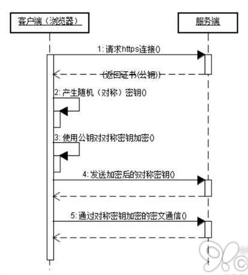

# <center> <b> 语言题
## <b> C++
### 1. STL的map和unordered_map分别的底层实现？区别？map如何传入比较方法？键值对的键如何设计？  
map底层实现是红黑树，unordered_map底层实现是哈希表；  
区别体现在元素是否有序、底层实现、查找时间、插入/删除时间上;  

|       | map | unordered_map     |  
| :---:       |    :----:   |  :---: |  
| 元素是否有序      | 按key排序|无|  
| 底层的数据结构   | 红黑树        | 哈希表     |  
|查找|O(log(n))|没有任何哈希冲突的情况下O(1)，最坏情况下O(n)  
|插入/删除|O(log(n))|与查找一致|  

可以以结构体对象或函数指针的方式传入比较方法（举例）：  
```c++
map<char,int,classcomp> m1;  //结构体对象classcomp需要重载operator()操作符
unordered_map<char,int,bool(*)(char,char)> m2(fn_pt);  //函数指针fn_pt就是比较函数
```  
自定义键的同时需要定义比较方式。
### 2. 如何让vector在用户分配的内存（堆）上分配空间?（vector元素的内存分配问题）  
```c++
vector<T> vec;  
vector<T*> vec;  //以上都是vec在栈上，元素在堆上
vector<T>* vec = new vector<T>();  //vec和元素都在堆上，这是我们想要的。
```  
参考资料：  
https://cloud.tencent.com/developer/article/1386206  
### 3. 函数的声明和定义可以不放在同一个头文件中吗？模板的声明和定义为什么要放在一个头文件中？  
普通函数可以不放在同一个头文件中，但模板函数不可以。这是因为对于编译器来说，模板实现也是一种声明，声明如何自动生成代码。模板的特性是即用即生。  
参考资料：  
https://www.cnblogs.com/wuchanming/p/4061659.html  
### 4. 程序文件（源文件）到可执行程序的过程？预处理做了哪些工作？  
预处理：根据预处理指令组装新的C/C++程序，如伪指令（宏定义#define、条件编译指令#if等、预编译指令#include）、删除注释、添加行号与文件名标识（用于编译时出现警告或错误时能够显示行号）、保留所有的#pragma编译器指令。  
编译：对预处理后的文件进行编译，生成汇编代码。  
汇编：对汇编代码进行翻译，生成目标文件（机器代码）。  
链接：将一个个目标文件链接在一起，生成可执行程序。  
参考资料：  
https://www.cnblogs.com/saolv/p/9629148.html  
### 5. new和malloc的区别？  
|特性|new/delete|malloc/free|  
|:-:|:-:|:-:|  
|内存分配位置|自由存储区|堆|  
|分配成功返回值|类型指针|void|  
|分配失败|抛出异常|NULL|  
|处理数组|new []/delete []|计算数组大小再分配|  
|已分配内存扩充|无法处理|使用realloc实现|  
|是否可以相互调用|可以使用malloc/free实现|不可以|  
|分配内存时内存不足|可以重新指定分配器|没办法|  
|函数重载|允许|不允许|  
|构造函数与析构函数|调用|没有|   

参考资料：  
https://www.cnblogs.com/ywliao/articles/8116622.html  
### 6. C++比C的优势？（C通过函数调用、指针也能实现类的封装、继承、多态等特性，为什么还有C++？）  
C++继承了C的特性，同时自身做了非常多的扩展：  
|特性|相比C的增强之处|  
|:-:|:-:|  
|类型检查|更严格，如添加bool类型、const、枚举变量|  
|输入输出流|cin/cout，格式控制比C倒是复杂了点|  
|函数重载与操作符重载|C没有|  
|默认参数|C没有|  
|引用|相比C指针，声明就要初始化|  
|new/delete|替换C中的malloc/free，对于C++中对象的生成与释放非常重要|  
|内联函数|替换C的宏，有类型检查|  
|类型强转|多了4个类型转化操作符，不允许C中那种void强转|  
|命名空间|C没有，用以解决命名冲突问题|  
|STL库|丰富且标准的第三方库，高效复用|  

参考资料：  
https://www.cnblogs.com/ckings/p/3632997.html  
https://www.cnblogs.com/jiangzhaowei/p/9129092.html  
### 7. 为什么要分成堆区和栈区？（内存管理问题）  
效率与存储的平衡。堆区是向高地址扩展，容量大，但申请时要与操作系统打交道，较慢；栈区相反，向低地址扩展，容量固定且小，由编译器管理，速度快。  
参考资料：  
https://www.cnblogs.com/houjun/p/4909413.html  
### 8. 动态链接和静态链接的区别？动态链接是怎么找到要链接的目标文件的？  
静态链接和动态链接两者最大的区别就在于链接的时机不一样，静态链接是在形成可执行程序前，而动态链接的进行则是在程序执行时。静态链接的缺点就是空间浪费和更新困难。动态连接损失一定性能，但能解决静态链接这两大困难。  
虽然动态链接把链接过程推迟到了程序运行时，但是在形成可执行文件时，还是需要用到动态链接库。比如我们在形成可执行程序时，发现引用了一个外部的函数，此时会检查动态链接库，发现这个函数名是一个动态链接符号，此时可执行程序就不对这个符号进行重定位，而把这个过程留到装载时再进行。  
参考资料：  
https://blog.csdn.net/kang___xi/article/details/80210717  
### 9.  多态是什么？静态多态和动态多态的区别？如何实现动态多态？  
多态性指相同对象收到不同消息或不同对象收到相同消息时产生不同的实现动作。  
静态多态与动态多态是基于绑定时间来区分的，前者在编译期，后者在运行时。静态多态一般指模板、函数重载，动态多态指类的继承与多态。  
动态多态靠虚函数实现。  
参考资料：  
https://cloud.tencent.com/developer/article/1688427
### 10. 父类的析构函数为什么需要定义为虚函数？什么是虚函数？虚函数表有什么用？虚函数的实现原理？虚函数表和虚函数指针分别属于类还是对象？  
父类的析构函数不定义为虚函数时且发生父类指针调用子类对象的行为时，释放父类指针时并不会调用子类对象的析构函数，存在内存泄漏的问题。  
虚函数的出现是为了实现动态多态；实现原理就是依赖虚函数表，每个类开头位置存放的就是指向虚函数表的指针，表中放了虚函数指针，实际的虚函数在程序代码段中（虚表指针->虚表->虚函数指针->虚函数（代码段））。当子类继承父类的时候也会继承父类的虚函数表，当子类重写父类中虚函数时，会将其继承到的虚函数表中的地址替换为重写后的函数地址。所以，使用了虚函数，会增加内存开销，降低效率。  
虚函数表是属于类的，不属于类对象，在编译的时候确定，存放在只读数据段。虚函数表指针属于类对象，存放在堆上或者栈上。  
### 11. 智能指针？智能指针原理（代码如何实现）？  
智能指针实质是一个对象，行为表现的却像一个指针，是为了方便管理堆内存的申请和释放，c++11头文件<memory>提供shared_ptr、unique_ptr、weak_ptr三种智能指针。  
引用计数和栈对象的有限作用域。  
参考资料：  
https://www.cnblogs.com/wxquare/p/4759020.html  
### 12. 类型转换cast？什么场景下使用？  
c++提供了4种类型转换操作符static_cast（静态类型转换）、reinterpret_cast（重解释类型转换）、const_cast（常类型转换）和dynamic_cast（动态类型转换）。  
static_cast<type>()：可以隐式转换的情况；  
reinterpret_cast：无法隐式转换的情况；  
const_cast：去const限定，只能用于指针与引用，不然会产生未知行为；  
dynamic_cast：用于父子类对象。  
### 13. C++11和C++14有哪些常用特性？  
|版本|新特性|  
|:-|:-|  
|C++11|关键字：auto/nullptr/foreach <br> STL容器：array/forward_list/unordered_map/unordered_set <br> 多线程：thread/atomic/condition_variable <br> 智能指针：shared_ptr/weak_ptr <br> 函数：function/bind/lambda表达式|  
|C++14|继续优化lambda表达式、constexpr、类型推导|  

参考资料：  
https://www.cnblogs.com/feng-sc/p/5710724.html  
https://www.cnblogs.com/coder-zhang/p/3970059.html
### 14. vector使用resize（）后发生了什么？  
有三种情况：  
1.当n小于当前容器的size时，会保留前n个元素，而把后面的元素销毁；  
2.当n大于当前容器的size但小于capacity时，补充元素至n个，补充的元素要么是指定的要么是该类型默认值；  
3.当n大于当前容器的capacity时，重分配内存，再回到第2种情况。  


# <center> <b> 基础题
## <b> 操作系统
### 1.下列代码建立了几个进程，输出多少个1？
```c++
for（int i = 0; i < 2; ++i）{
    fork();
    printf("1\n")
}
```
6个。fork函数是让子进程完全拷贝父进程，包括父进程上下文，也即是子进程下一条该执行的命令与父进程完全一样。这样来解释这个程序就是：  
能执行2次循环，有2个进程（父进程和fork出的第一个子进程）；  
能执行1次循环，也有2个进程（是前面循环已经出现的进程fork出来的）。  
### 2. 为什么需要虚拟内存？  
为了解决早期内存分配机制（直接使用物理地址）的三大问题：进程地址空间不隔离、内存使用效率低、程序运行的地址不确定。  
参考资料：  
https://www.cnblogs.com/wujing-hubei/p/6253380.html  
### 3. 编址大小，32位机器插四个2G内存，可以使用嘛？  
32位寻址范围只能4GB。  
### 4. 进程和线程的区别？如何创建进程和线程？进程切换为什么比线程切换代价高，高在哪？  
资源与CPU分配上；隔离性和安全性上；创建开销上等等。  
fork()进程（unix系统文件unistd.h）；thread线程（c++11标准thread库）。  
进程切换会多经历切换页目录与使用新的地址空间这一步，这会导致内存缓存（TLB）失效，从而导致内存的访问非常低效。  
参考资料：  
https://www.cnblogs.com/topass123/p/12801540.html
### 5. 了解协程吗？跟线程进程有什么区别？  
协程（Coroutine），一种基于线程之上，但又比线程更加轻量级的存在，这种由程序员自己写程序来管理的轻量级线程叫做用户空间线程，具有对内核来说不可见的特性。  
协程由用户调度，占用资源一般在KB，不多，切换开销小（需要修改的寄存器少），同步不需要加锁。  
参考资料：  
https://cloud.tencent.com/developer/article/1546730  
### 6. 死锁？产生条件？怎么解决？  
死锁就是有两个或者多个进程由于竞争资源而造成阻塞的现象。  
四个必要条件：互斥条件（资源一段时间只能由一个进程占用）、请求和保持条件（占有资源的同时，还提出新的资源请求）、不剥夺条件（进程已经获得的资源，在未使用完前，不能被剥夺）和环路等待条件（互相等待对方进程占用的资源）。  
加锁顺序（让所有线程的加锁尽量一致）；加锁时限（加个超时时间，超时了就回退，再重做）；死锁检测（检测出死锁可以释放所有锁，回退，并且等待一段随机的时间后重试；或者给这些线程设置优先级，让一个（或几个）线程回退，剩下的线程就像没发生死锁一样继续保持着它们需要的锁）。  
参考资料：  
https://www.cnblogs.com/sthu/p/9660914.html  

### 7. 进程通信和线程通信有哪些？  
进程之间通信：管道（单向流动、亲子进程之间）、有名管道（允许无亲缘关系的进程间通信）、信号量（计数器，用于同步）、消息队列、信号（通知接收进程某个事件已经发生）、共享内存（最快的IPC方式，配合信号量使用，用于同步与通信）、套接字。  
线程之间通信（同步/互斥的手段）：锁机制（互斥锁、条件变量、读写锁）、信号量机制、信号机制。  
参考资料：  
https://www.cnblogs.com/fanguangdexiaoyuer/p/10834737.html  

### 8. 多线程存在的问题是什么？  
上下文切换开销、死锁、资源限制。  
参考资料：  
https://blog.csdn.net/Swh1234567/article/details/107896124  

### 9. 知道哪些锁？你刚才提到乐观锁，乐观锁是锁吗？   
紧跟上题，应该指的是多线程编程中会用到的锁：mutex（互斥锁，常配合条件变量使用）、读写锁（读共享、写独占）、自旋锁（不休眠，一直等待）。乐观锁是java中的概念。  
参考资料：  
https://blog.csdn.net/xy_cpp/article/details/81910513  

### 10. malloc申请一块内存会不会立刻绑定到物理内存？  
考察虚拟内存。操作系统现在采用的一般是段页式虚拟内存管理机制，malloc申请内存也是得到虚拟地址，经过地址映射才能得到实际的物理地址。

### 11. 页面置换算法有哪些？LRU和LFU的区别？LRU和LFU如何实现？  
OPT（最佳置换法）：理想情况下选择不再使用的页置换，实际上实现不了，可作为其他算法的参考；  
FIFO（先进先出法）：淘汰最早进入内存的页，队列即可实现；  
LRU（最近最久未使用算法）：置换最久未使用的页，可以使用LinkedHashMap(java)实现；  
LFU（最近最少使用算法）：淘汰最近一段时间内最少被使用的页，这其实是topK问题，可采用小顶堆+哈希表实现。

## <b> 网络
### 1. tcp与udp的区别？tcp为什么可靠（tcp可靠传输如何实现）？TCP为什么数据量比UDP大？ 如果有1M数据，两者会差多少？  


### 2. 输入url到页面展示的过程？  
DNS解析:将域名解析成 IP 地址  
TCP连接：TCP 三次握手  
发送HTTP请求  
服务器处理请求并返回 HTTP 报文  
浏览器解析渲染页面  
断开连接：TCP四次挥手  
参考资料：  
https://zhuanlan.zhihu.com/p/57895541  
### 3. 为什么要分成7层网络结构？  
架构分层的目标都是希望实现单一职责原则，独立且高效协同工作，提升多人开发效率。  
### 4. https通信过程？  
HTTPS=HTTP over TLS(SSL)，保证传输过程中的安全性，减少被恶意劫持的可能。具体过程如下：  
  
TLS包括对称加密（DES）/非对称加密(RSA)/HASH算法。  
### 5. 网络层和传输层为什么不能合并？  
传输层的代码完全运行在用户的机器上，但是网络层主要运行在由承运商控制的路由器上。用户在网络层上并没有真正的控制权，所以他们不可能用最好的路由器或者在数据链路层上用更好的错误处理机制来解决服务太差的问题。唯一的可能是在网络层之上的另一层中提高服务质量。这就是传输层存在的必要性。  
参考资料：  
https://www.cnblogs.com/MMLoveMeMM/articles/3585633.html  
### 6. tcp拥塞控制？  

### 7. GET和POST的请求有长度限制吗？是多少?  

## <b> 数据库
### 1. b树和b+树的区别? 什么样的字段适合建索引？根据经验的话，哪些情况下需要建立索引？  
### 2. MySQL的存储引擎有什么? 有什么区别？ Innodb和MyISAM的区别是什么？  
### 3. 事务隔离级别？  
### 4. 当前读和快照读的区别？  
### 5. Redis如何使用？Redis的持久化机制？  
### 6. Redis的网络模型是怎么样的？  
## <b> 设计模式
### 1. 什么是单例模式？代码实现？
## <b> Linux
### 1. select poll epoll区别？  
### 2. epoll中ET和LT的区别？  
### 3. 说说软连接，硬链接，目录能不能用硬链接？  
### 4. 进程通信：用过什么信号，说几个常见的？  